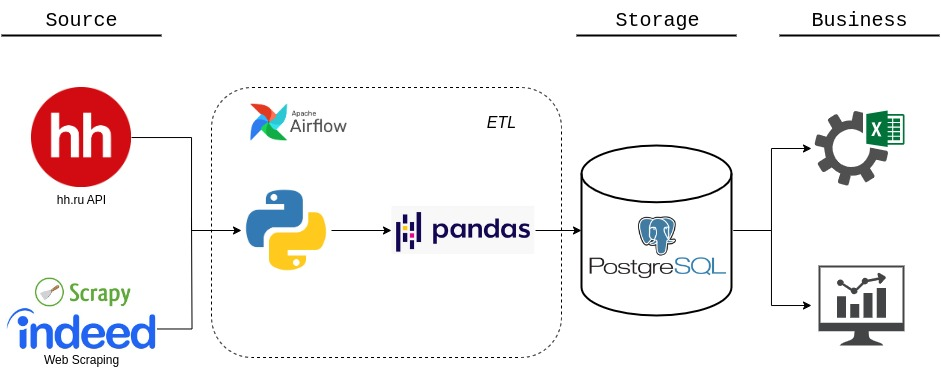

## Analytical Solution Arhitecture

### About:
The aim of the project is to collect actual data on open vacancies and requirements to the candidate, to obtain generalized information on salaries, necessary experience and skill sets of the candidate.

The project is aimed at both business users (recruiting) and household users, with the purpose of conducting labor market research to establish the actual criteria for the position and studying the requirements for candidates to optimize the educational process.
