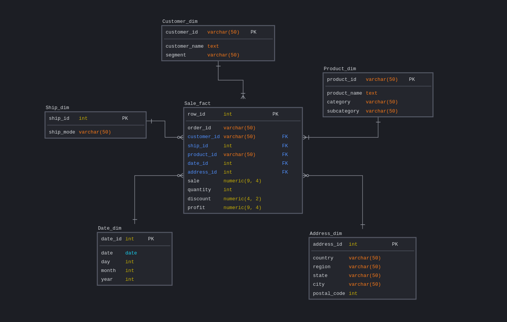

## Queries for lab from Module 01

Superstore Total Sales, Total Profit, Profit Ratio, Profit per Order, Sales per Customer and Avg. Discount:
```
SELECT ROUND(SUM(sales), 2) total_sales,
    ROUND(SUM(profit), 2) total_profit,
    ROUND(SUM(profit) / SUM(sales) * 100, 2) profit_ratio,
    ROUND(SUM(profit) / COUNT(DISTINCT order_id), 2) profit_per_order ,
    ROUND(SUM(sales) / COUNT(DISTINCT customer_id), 2) sales_per_customer,
    ROUND(AVG(discount), 2) avg_discount
FROM orders;
```

Monthly Sales by Segment:
```
SELECT segment,
	EXTRACT(month FROM order_date) order_month,
	ROUND(SUM(sales), 2)
FROM orders
GROUP BY segment, order_month
ORDER BY order_month;
```

Monthly Sales by Product Category:
```
SELECT category,
	EXTRACT(month FROM order_date) order_month,
	ROUND(SUM(sales), 2)
FROM orders
GROUP BY category, order_month
ORDER BY order_month;
```

Sales by Product Category over time:
```
SELECT category,
	order_date,
	ROUND(SUM(sales), 2) sales_over_time
FROM orders
GROUP BY category, order_date
ORDER BY category, order_date;
```

Sales and Profit by Customer:
```
SELECT customer_id id,
	customer_name name,
	ROUND(SUM(sales), 2) sales,
	ROUND(SUM(profit), 2) profit,
	RANK() OVER (ORDER BY ROUND(SUM(sales), 2) DESC) rank
FROM orders
ORDER BY id, name;
```

Sales per Region:
```
SELECT region,
	ROUND(SUM(sales), 2) sales
FROM orders
GROUP BY region
ORDER BY sales DESC;
```

## Superstore Dimensional Data Model



## DDL

```
-- Dimensional Tables

DROP TABLE IF EXISTS Customer_dim;
CREATE TABLE Customer_dim
(
     customer_id   varchar(50) NOT NULL,
     customer_name text NOT NULL,
     segment       varchar(50),
     CONSTRAINT PK_1 PRIMARY KEY (customer_id)
);

DROP TABLE IF EXISTS Address_dim;
CREATE TABLE Address_dim
(
     address_id  int NOT NULL,
     country     varchar(50) NOT NULL,
     region      varchar(50) NOT NULL,
     state       varchar(50) NOT NULL,
     city        varchar(50) NOT NULL,
     postal_code int NOT NULL,
     CONSTRAINT PK_1 PRIMARY KEY (address_id)
);

DROP TABLE IF EXISTS Date_dim;
CREATE TABLE Date_dim
(
     date_id int NOT NULL,
     date    date NOT NULL,
     day     int NOT NULL,
     month   int NOT NULL,
     year    int NOT NULL,
     CONSTRAINT PK_1 PRIMARY KEY (date_id)
);

DROP TABLE IF EXISTS Product_dim;
CREATE TABLE Product_dim
(
     product_id   varchar(50) NOT NULL,
     product_name text NOT NULL,
     category     varchar(50),
     subcategory  varchar(50),
     CONSTRAINT PK_1 PRIMARY KEY (product_id)
);

DROP TABLE IF EXISTS Ship_dim;
CREATE TABLE Ship_dim
(
     ship_id   int NOT NULL,
     ship_mode varchar(50) NOT NULL,
     CONSTRAINT PK_1 PRIMARY KEY (ship_id)
);


-- Fact Table

DROP TABLE IF EXISTS Sale_fact;
CREATE TABLE Sale_fact
(
     row_id      int NOT NULL,
     order_id    varchar(50) NOT NULL,
     customer_id varchar(50) NOT NULL,
     ship_id     int NOT NULL,
     product_id  varchar(50) NOT NULL,
     date_id     int NOT NULL,
     address_id  int NOT NULL,
     sale        numeric(9, 4) NOT NULL,
     quantity    int NOT NULL,
     discount    numeric(4, 2) NOT NULL,
     profit      numeric(9, 4) NOT NULL,
     PRIMARY KEY (row_id),
     FOREIGN KEY (customer_id) REFERENCES Customer_dim (customer_id),
     FOREIGN KEY (ship_id) REFERENCES Ship_dim (ship_id),
     FOREIGN KEY (product_id) REFERENCES Product_dim (product_id),
     FOREIGN KEY (product_id) REFERENCES Product_dim (product_id),
     FOREIGN KEY (date_id) REFERENCES Date_dim (date_id),
     FOREIGN KEY (address_id) REFERENCES Address_dim (address_id)
);
```
